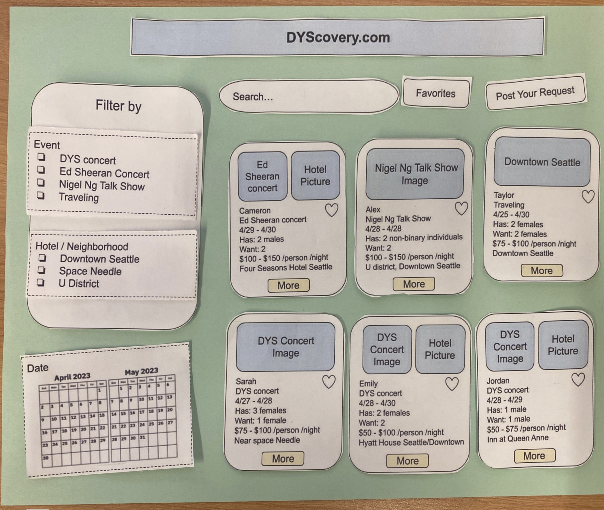
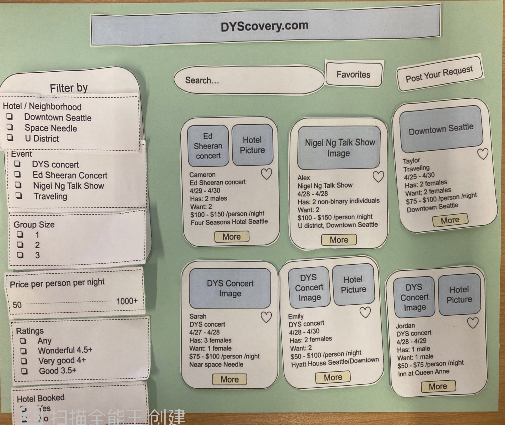
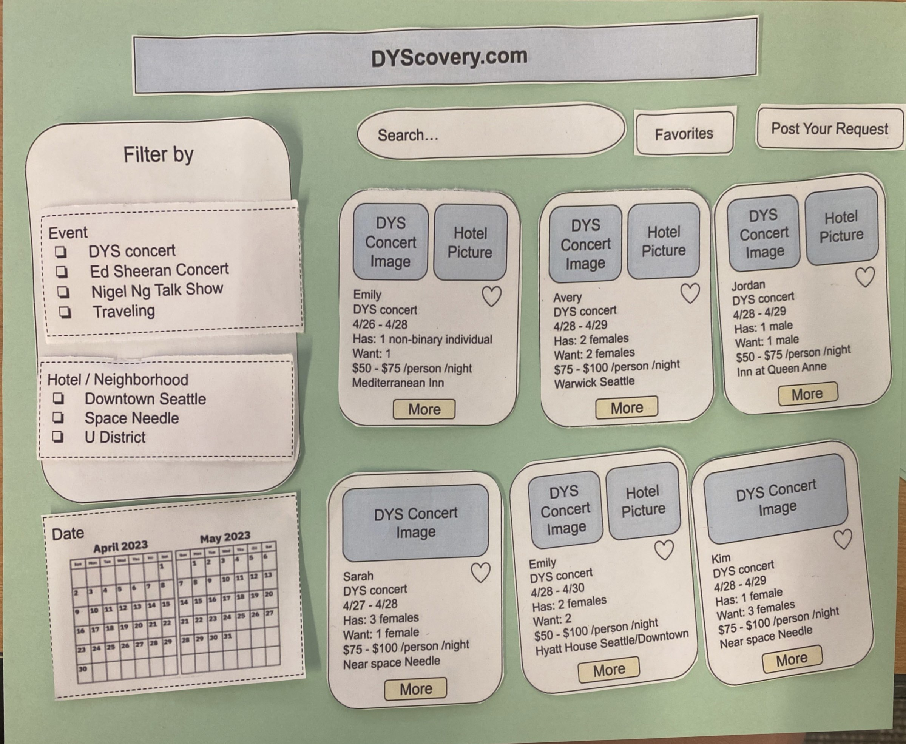
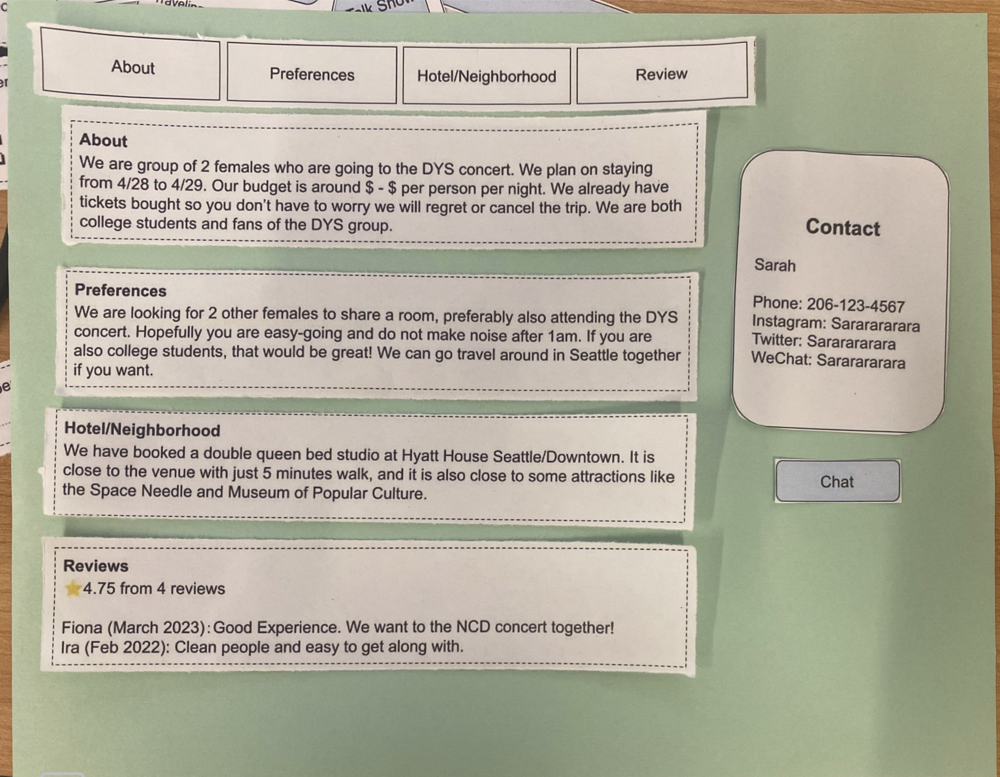
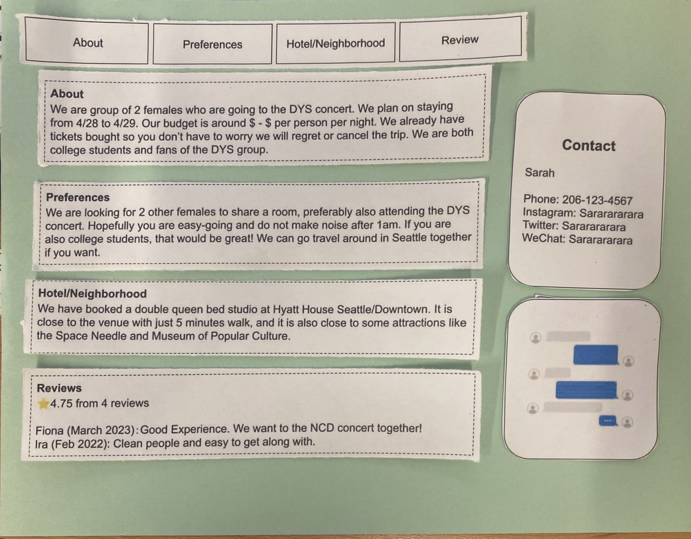
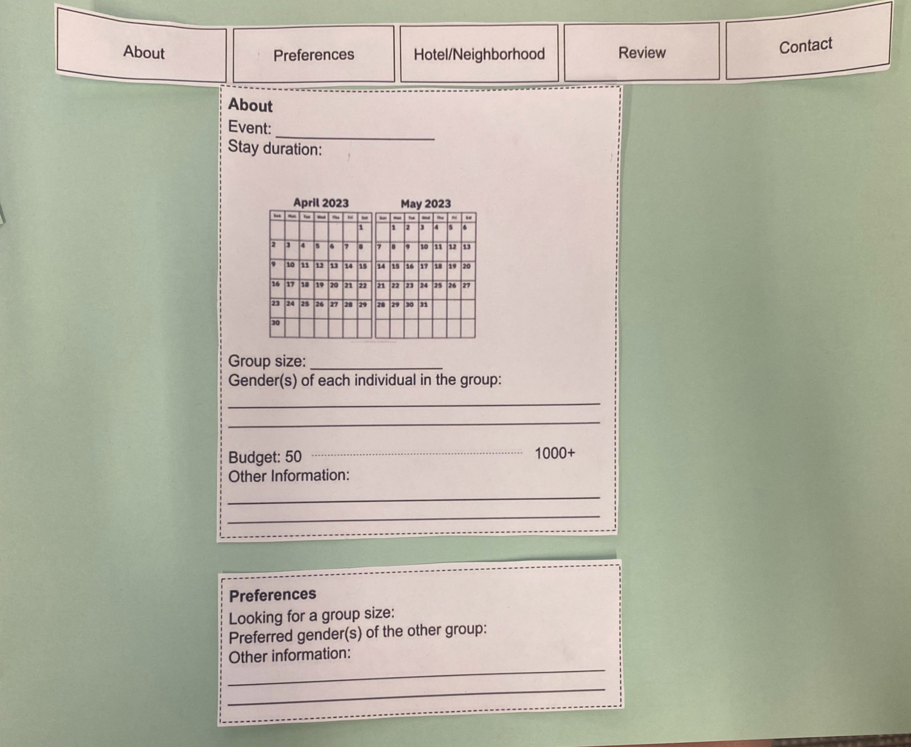
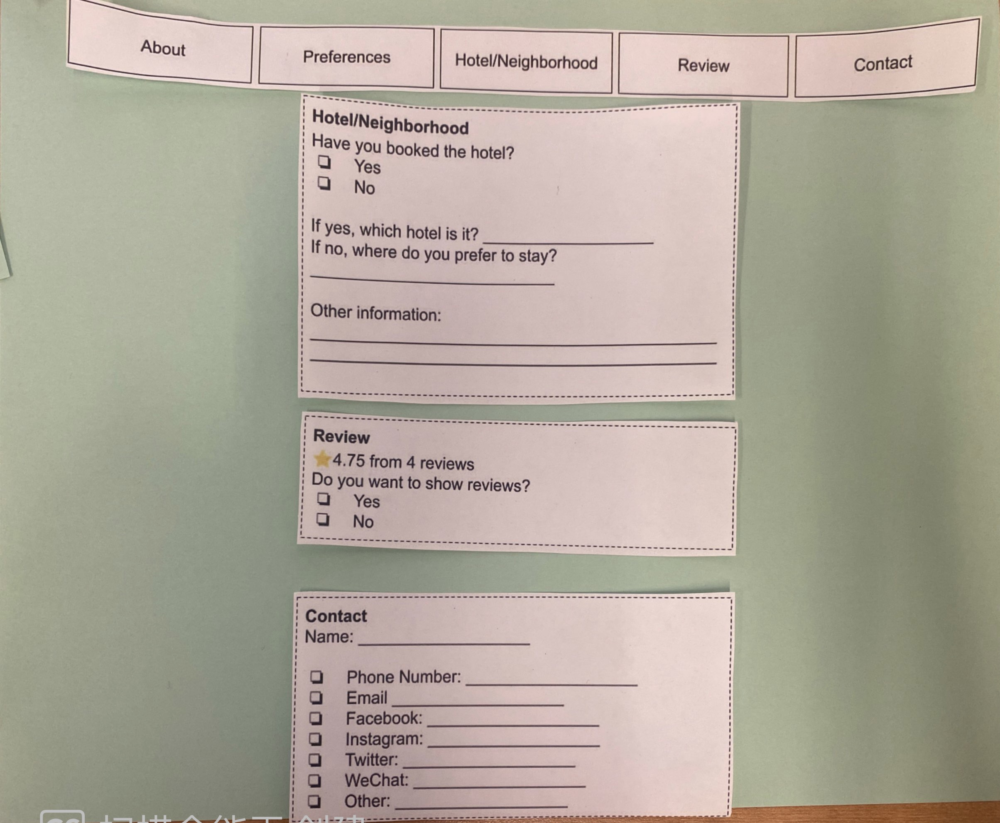

# Prototype Design

## A: Description of low-fidelity prototype

### What are the components?

The purpose of our paper prototype is to test how participants can engage with the project user interface, to ensure the flow between components and pages is smooth and to get user feedback on the structure of interface components.

The first page of the prototype flow is the home page. This has various sub-components, such as:

-   Website logo

-   Search bar

-   Filter component

-   Button to create a post

-   'Preview-style' user postings

After a user search is made or filters are adjusted, the overall format will be the same as described above, albeit with posts that align with user preferences.

If users click on a 'preview-style' user posting, they will be taken to a detailed user posting page. This page has some 'tab' components that allow the user to view details about the profile who posted the listing when they clicked, such as: an overall about, preference information, hotel/neighborhood information, and reviews. Every page has a 'contact information' component that shows the basic information such as the profile user's name and whatever social media information they have provided. We will have two versions of this page, one with a chat button and one without. This is because we would also like to take the opportunity from prototype testing to investigate the 'social' question of whether users would prefer to have a platform-based chat or use their own communication methods, such as by sharing their phone number if they would be willing to do so.

The purpose of our 'make a post' page prototyping is to identify a layout that participants feel comfortable with, as well as identify what personal information components they would both like to see and feel comfortable sharing. Information components that we are working with include:

-   Personal Info: Event name, Stay duration calendar, Group size, Gender, Budget, Other

-   Preferences: Group size, Gender, Other

-   Hotel/neighborhood: Hotel booking status (yes/no, if yes: which), Hotel preferences, Other

-   Rating: Option to display received reviews

-   Contact: Name, Phone number, Email, Facebook, Twitter, WeChat, Other

We are 'wizarding' the following in this prototype:

-   Contact platform. If participants would like to contact a poster, we will 'wizard' the communication aspect with standard SMS messaging.

-   Uploading posts. Participants who want to upload a post will be presented with a paper form, to which they can add their personal information.

-   We are also bootstrapping content by creating many initial posts looking for roommates in order to set norms for the community, and avoid our system seeming very sparse. This will also help us identify how participants will behave in an ideal system where there is a community using our application and avoid forcing them to bootstrap our community for us, which could become an awkward and unpleasant experience.

Additionally, on the next page, you can find images of our component pieces. Individual components will be cut out and placed per our initial envisionment on the page but are adjustable so that participants can actively interact with features such as sliders while also adjusting their locations to their preferences if they wish in order to obtain more information on what participants think of the user flow.

## B: Screenshots, drawings, or photos (or other) of the prototype

### Overview of paper prototype components
- [Tabs](https://docs.google.com/drawings/d/1ph7er8MHt-1_7_geXIm11vyP1EFxBSR59ZAF7-YGkCQ/edit?usp=share_link)
- [Posts, Search bar, Button](https://docs.google.com/drawings/d/1YhLhpINf7QM_o_Dlo7EJrVXzBAjCnr-Ej_abmFFXXYo/edit?usp=share_link)
- [Posts, Filter](https://docs.google.com/drawings/d/1M5dtW_IWaWVtS_YA_ux3r1OFzvg5FSrOaqULOxeG7Ck/edit?usp=share_link)
- [Post your request page](https://docs.google.com/drawings/d/1d2Xnwl_TFGqV7TZ3Q-0bTVSkQSUR3QhAmiAES7AeAQE/edit?usp=share_link)

### Task 1: browse through posts to look for roommates
Starting from the homepage, a user uses the filter on the left to find posts about the DYS concert.
 

After clicking on a post, the user is directed to the detail page where they can find more information, as well as chat with the user who made the post.

### Task 2: create a post to look for roommates
A user can click on the “post your request” button on the top right corner on the homepage to be redirected to a page where they can create a post to look for roommates.
 
 

After filling in the information, a new post will appear on the homepage for others to browse.
 

