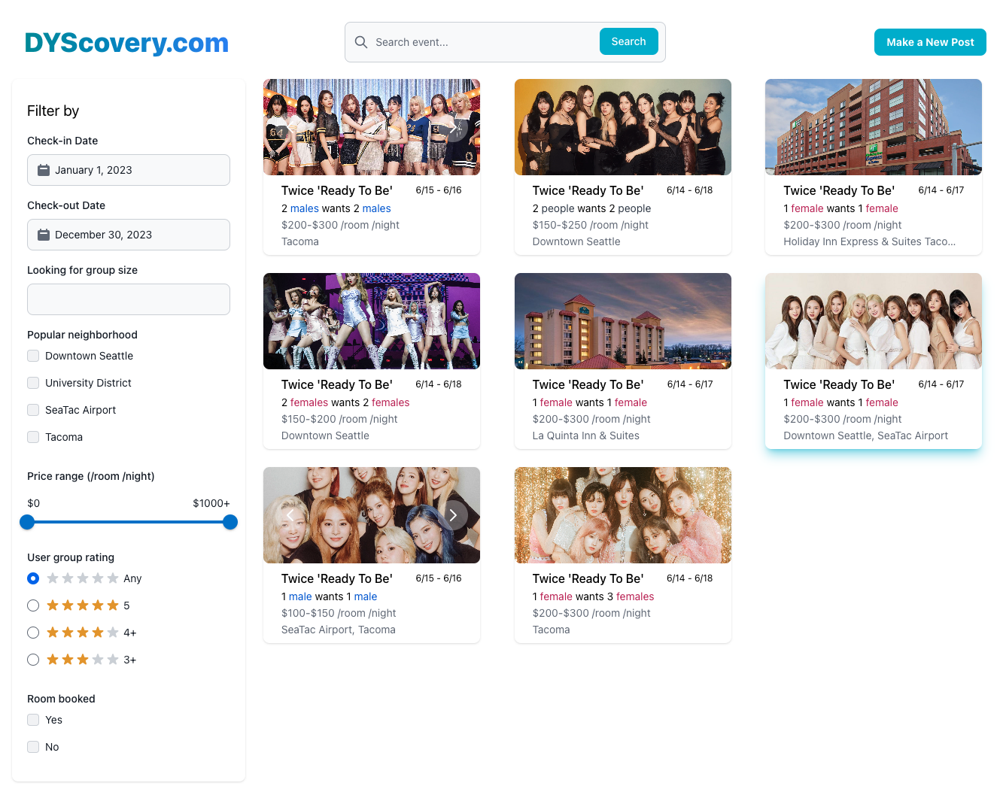
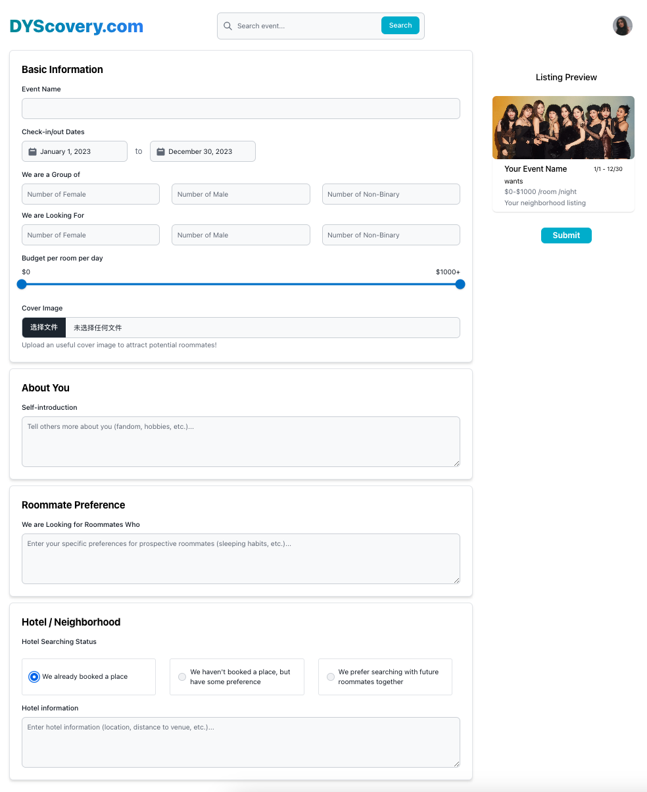
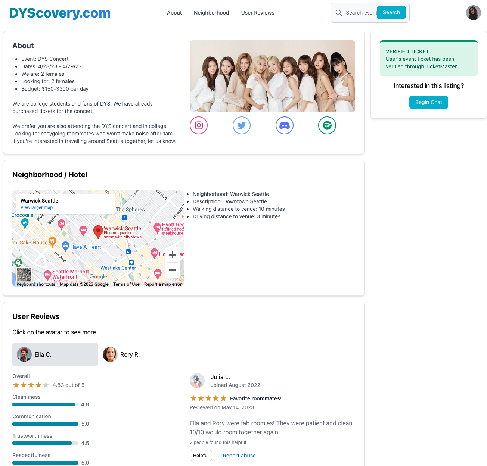

# User Testing

## A: Description of medium-fidelity prototype
We are developing a web-based application that allows concertgoers who attend concerts in different cities and look for short-term roommates to ease their living budgets to match with each other. The two functionalities we currently implement are:

- Allow users to look for people attending the same event or event in the same city, with lodgings booked or who want to look for lodging together using a “browse feed” style interface.
- Allow users to post their own listing with information about themselves and existing roommates/lodging, in order for other people to join them.

Our code can be found at https://github.com/UWSocialComputing/DYScovery-code/tree/master. Specifically, most of the functionality for browsing is found in the results page and details page. Most of the logic to submit a post is found here. 

Right now, we have not implemented the code to get data passed between screens, so we wizard-of-oz that part when it comes to displaying the detail page of a specific listing, as well as generating a specific listing based on the information users put down. We omitted the chat feature as well as the verification workflow, but we plan to at least code up some additional screens representing those features in the next few days.

## B: Screenshots / photos of prototype

## C: Findings from user testing sessions
Overall, our user testing sessions indicated that users found the website aesthetically pleasing, generally easy to navigate with a ‘familiar feel’ and were able to perform the tasks being tested without difficulty. Our participants felt that the navigation was relatively smooth and straightforward. They also liked the ticket verification feature, to navigate initial safety concerns brought up.  We received some feedback on various components through the feedback. The following table describes our detailed learnings and future plans based on our user testing sessions.

| Learning | Future |
| --- | --- |
| Homepage: explore cards look clickable, but aren’t, causing confusion for users. Users also felt it may be better not to have cards on the homepage for privacy reasons, so site visitors have to complete a search to view postings. | We will remove the posting card from the homepage. We may replace those with concert information suggestions (such as current popular events) that give hints on what to put inside the search bar, or we may just get rid of the explore portion completely. |
| NewPost page: the “gender-number” input fields are required to be filled on submission. This can be intimidating because the users felt that entering 0s felt antagonistic, when this was just for safety concerns. One participant also preferred to have the gender-neutral option for “people”. | NewPost page: the “gender-number” input fields are required to be filled on submission. This can be intimidating because the users felt that entering 0s felt antagonistic, when this was just for safety concerns. One participant also preferred to have the gender-neutral option for “people”. |
| NewPost page: the current version of the error message for when some fields are not filled out is not very informative. It would be better to make it clearer which fields are missing when the form fails to submit. | We tried to add a “required” keyword to the input fields, but for some reason it is not working as we expected. We will update the missing information in the error message so the users can have a clearer understanding, and try to fix this feature for the next prototype submission. |
| Results page: one participant wants a filter for genders as well, but there is not that option. | Like the NewPost page, we may add an option to allow users to filter either by the total number count, or specify a particular gender count. |
| Details page: Hotel name vs neighborhood name is not clear enough to users. | We will make sure the hotel name is explicitly listed. |
| Details page: the categories for ratings can be reworded a bit. The communication is quite clear, but the participant is confused by what it means for “trustworthiness”. If there is a low score, they would like to know the reason for it. |We will improve the word choices for the categories. For the low scoring explanation, due to time limitations, we may not implement such a feature, but the idea is that we can filter out reviews that relate to that category using some language model. |
| Details page: the navigation bar on the top (together with the user avatar) is not necessary for redirecting to a particular part of the details page since the page itself is not too long to scroll through. Also, it can be confusing because the navigation bar looks like a link to a different page, instead of jumping to a different place on the same page. | We will remove those from the top bar. We may add a sidebar instead for jumping around to anchors on the Details page instead. |
| Details page: styling of the list items can be improved. Right now it feels a little overwhelming because all the text items are weighted equally in the list items. | We will adjust the styling for the list items so each category can be differentiated easier, and important info stands out to users.|
| NewPost page: Some participants were confused about the language indicating their status on hotel decisions. | We will clarify this language to make sure users understand the options they are choosing between when making a selection. |
| Details page: Users wanted more information about the posters visible to them immediately. | We will have a copy of user profile links available in the interest card along with the existing profile links with reviews. |
| Details page: The language of user reviews was not clear enough. | We will clarify that the reviews are about the posters/hosts of the posting. |

The findings are promising enough that we would like to go ahead with the current functionality of the prototype. We will update some features based on the feedback above. Further, we plan to implement some more functionalities. Specifically, we will need to implement having data passed between screens. Currently, we hardcoded in data for the details page and new form submission, but with our next iteration, we would like to ensure each details page reflects the appropriate data and that when the form is submitted, our website persistently updates. Finally, we will add a user interface for a chat window between posters and browsers. Due to time constraints, this will not be a persistent chat, but will last for one user session.
