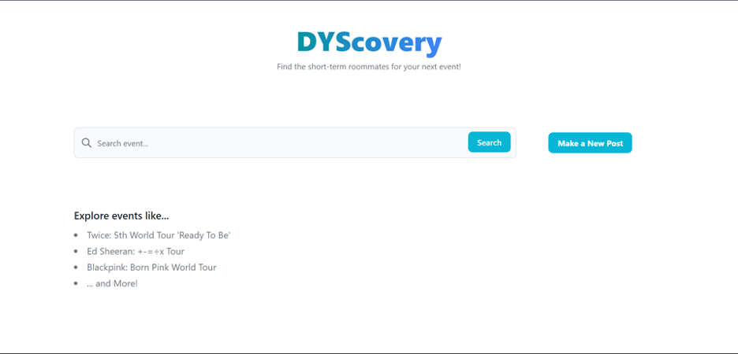
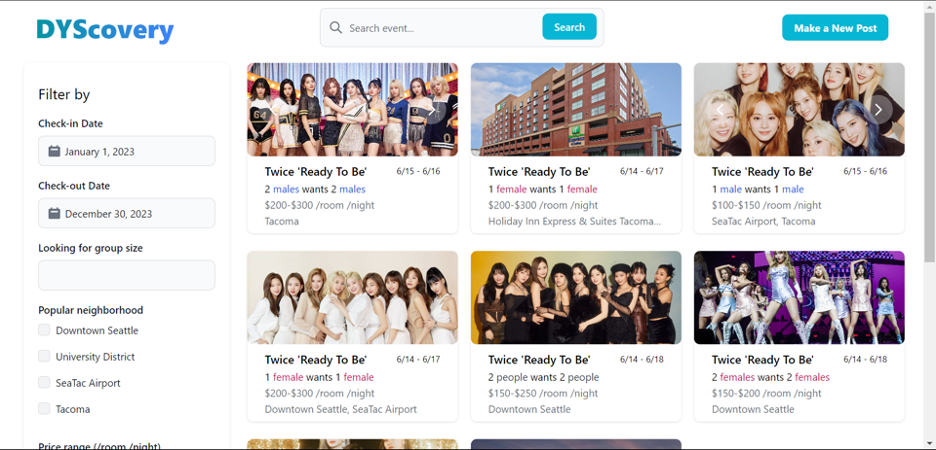
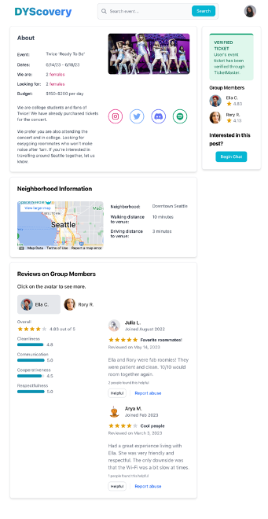
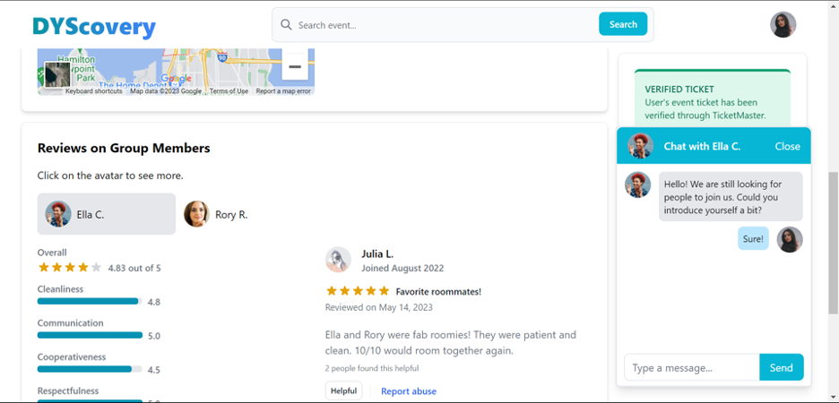
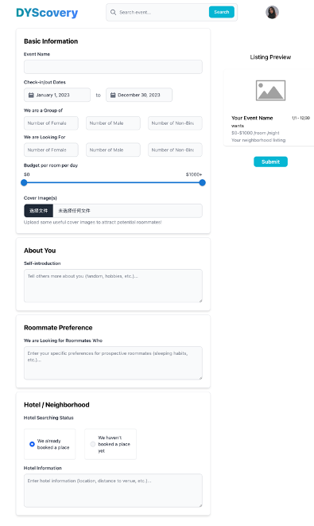

# G7: Digital Prototype

## Problem Statement
The live music industry is growing in popularity, but concerts are often constrained to venues in major cities, states or countries. Consequently, concertgoers often find that they need to pay not only for tickets subject to dynamic demand-based pricing systems but also for flight tickets, taxis and hotel rooms for the concert duration. One cost-saving measure that has cropped up amongst concertgoers is to find short-term “roommates” to share a hotel room with. Concertgoers also find roommates a convenient way to find people to share a ride with, in order to reduce dangers associated with ridesharing at the late hours that concerts end.

In this project, we aimed to better understand the problems faced by **those who attend concerts in places other than their hometowns** and build a social computing system that acts as a matchmaker for short-term roommate finding.

## Description of Final Prototype

This premise led us to develop DYScovery, a platform that allows users to look for short-term roommates.

### Code: Design

As we began our prototype development, we decided to narrow down the user flows that needed to be made possible through the platform. The first of these functionalities is the ability to browse through potential roommates’ posts, where users can look for roommates attending the same event. The second of these functionalities is the ability to create a posting in order to allow others to contact you about rooming with you.

### Code: Technical Description

Given the above user functionalities we wanted to make possible, we settled on an overall design for our system. At the lowest level, we required a database with information about users, posts, reviews and chat histories. Due to time constraints, we “wizard” the database with a hard-coded JSON file. The main capabilities of our system’s backend are to get data for post listings, both the short-form view and detailed view. Then, we have front-end components that allow the users to interact with the platform, with functionalities such as making/viewing/filtering posts. We also have some front-end components that function in a “wizard-y” way, such as making/viewing reviews, making/viewing chats and making new posts.

### Iterative Changes

After creating a medium-fidelity prototype, we conducted a user testing session to gain feedback for improvements. Overall, our user testing sessions indicated that users found the website aesthetically pleasing, generally easy to navigate with a ‘familiar feel’ and were able to perform the key tasks identified earlier without difficulty. We received some feedback on various components through the feedback, such as to alter typography for user clarity and make some error messages and language used clearer. Based on this, we did not make any significant pivots, but did work on improving the interface for users after the testing session

## Final Prototype

You can play with our prototype [here](https://uwsocialcomputing.github.io/DYScovery-code/)! Our GitHub repo for code can be found [here](https://github.com/UWSocialComputing/DYScovery-code). 

### Home

Upon opening our platform, users will be directed to this homepage. They can search specific events using the search bar, or make a new post by clicking on the button on the right.

### Browse Posts

When users enter an event name in the search bar and click "search," they will be automatically redirected to the search results page. Each relevant listing on the page will display a preview of key information such as the duration of stay, group size, neighborhood, and price of the place. Users can also use the filter on the left to narrow down their search results based on those criteria.

### Detailed Post

After clicking on a specific listing, users will be directed to the detail page, where they can get more information about the group/individual who makes the post, the neighborhood and hotel where they plan to stay, and the past reviews from those who have roomed with them before. 

If someone is interested in joining the group, they can use the chat feature to talk to each other.

### Make a New Posting

If someone has a rough plan in mind and wants to actively find people to join them, they can create a new post by simply clicking the "make a new post" button. They can provide details about themselves, the type of roommate they are seeking, the preferred locations they are considering, and more. Additionally, they have the option to upload cover images for their post and preview how it will appear on the platform.

